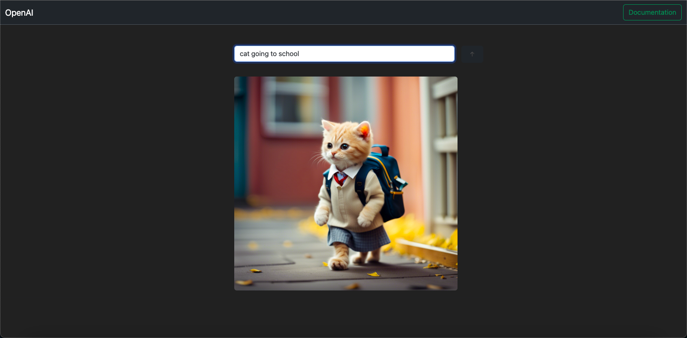
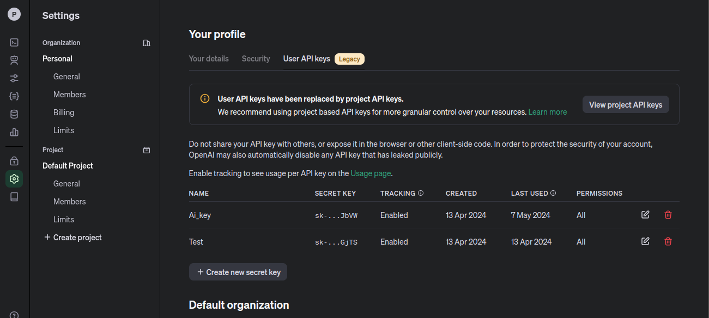
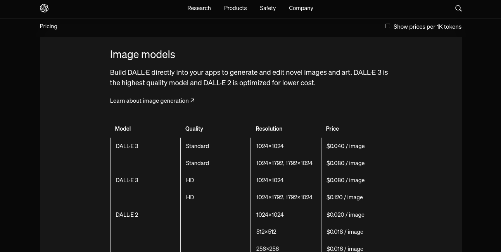

# OpenAI-Image-Generation-NodeJs


## How to Create

1. Create an Account on Open Ai - [Click here](https://openai.com/)
2. Create Secret API Key - [Click here to create api-key](https://platform.openai.com/api-keys)


### How to Generate Image using OpenAI 
Documentation: [Image Generation Doc](https://platform.openai.com/docs/guides/images?lang=node.js&adobe_mc=MCMID%3D60047592739492077280307194424969051085%7CMCORGID%3DA8833BC75245AF9E0A490D4D%2540AdobeOrg%7CTS%3D1701353004&context=node) 

The Images API provides three methods for interacting with images:

1. Creating images from scratch based on a text prompt (DALL·E 3 and DALL·E 2)
2. Creating edited versions of images by having the model replace some areas of a pre-existing image, based on a new text prompt (DALL·E 2 only)
3. Creating variations of an existing image (DALL·E 2 only)

We are here, Using First method to create image from text prompt.

- We are using dall-e-3 here
```js
const generateImage = async function(req, res){

    const prompt = req.body.prompt;
    
    try{
      const response = await openai.images.generate({
          model:'dall-e-3',
          prompt:prompt,
          n:1,
          size:"1024x1024"
      });
      
      image_url = response.data.data[0].url;      
      
      res.send(image_url);
    }catch(err){      
      res.send(err);
    }
}
``````
#
Method: POST

Url: https://api.openai.com/v1/images/generations

response-body
```json
{
  "created": 1589478378,
  "data": [
    {
      "url": "https://..."
    },
    {
      "url": "https://..."
    }
  ]
}
```

### Image Model - Price



